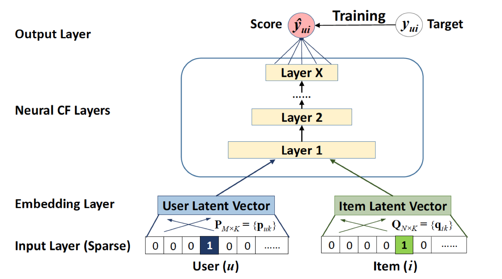

# Day 2 - Neural Collaborative Filtering (NCF)

## Model: Simple NCF

## Model: Full NCF

## TODOs
1. Inside practice.py, try implementing class simpleCF. simpleCF receives a batch input of users and items. Convert two ID inputs into embedding vectors, feed to 3-layered MLP and directly predict ratings. The output of this model returns a tensor of predicted ratings, with shape (batch_input). If you achieve MAP <= 0.9, it is working. 

## Movie ratings prediction (Full NCF)
| Epoch | MAE |
| :---: | :---: |
| 1 | 0.8815115094184875 |
| 2 | 0.7833456993103027 |
| 3 | 0.7571370005607605 |
| 4 | 0.741300106048584 |
| 5 | 0.733877420425415 |
| 6 | 0.7251555323600769 |
| 7 | 0.7211894392967224 |
| 8 | 0.7187884449958801 |
| 9 | 0.7180564999580383 |
| 10 | 0.7129073143005371 |

### Movie ratings prediction (Full NCF)
| Epoch | MAE |
| :---: | :---: |
| 1 | 0.8548901677131653 |
| 2 | 0.8032435774803162 |
| 3 | 0.7829871773719788 |
| 4 | 0.7717518210411072 |
| 5 | 0.7604358196258545 |
| 6 | 0.7667009234428406 |
| 7 | 0.7586390972137451 |
| 8 | 0.7651193141937256 |
| 9 | 0.7613377571105957 |
| 10 | 0.756910502910614 |

